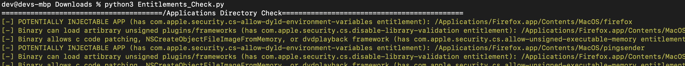
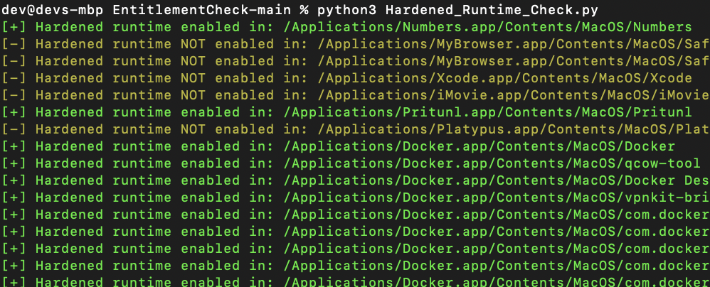

# Entitlement AND Hardened Runtime Check
Wrapper around the codesign binary to recursively check installed apps for problematic entitlements and for whether or not Hardened Runtime is enabled. 

Currently the scripts check for the following entitlements:

- com.apple.security.cs.disable-library-validation
- com.apple.security.cs-allow-dyld-environment-variables
- com.apple.security.get-task-allow
- com.apple.security.cs.allow-unsigned-executable-memory
- com.apple.security.files.downlaods.read-only
- com.apple.security.files.downloads.read-write 
- com.apple.security.files.all (deprecated...but you never know...)
- com.apple.security.files.user-selected.read-only 
- com.apple.security.files.user-selected.read-write
- com.apple.private.security.clear-library-validation 
- com.apple.private.tcc.allow

**NOTE: It is possible that an app can have one or more of the entitlements above while also having hardened runtime enabled (which may mitigate the attack path for abusing the entitlement in question). To check specifically for hardened runtime, run the command below and search for flags in the output:**

For Hardened Runtime checks, my script runs the command below and filters based on output:

`codesign --display --verbose /Applications/[name]/Contents/MacOS/[name]`

The following directories are checked by both the Entitlements and Hardened Runtime Check Scripts:
- /Applications
- /usr/local/bin 
- /usr/bin 
- /usr/sbin

## Steps

**Python Script Instructions:**
1. Entitlements Check: `python3 Entitlements_Check.py `
2. Hardened Runtime Check: `python3 Hardened_Runtime_Check.py `
3. results will be displayed to stdout. Can simply redirect to an output file as well (ex: `python3 Hardened_Runtime_Check.py > outfile.txt`)

Sample output from Entitlements_Check.py:

Sample output from Hardened_Runtime_Check.py:

