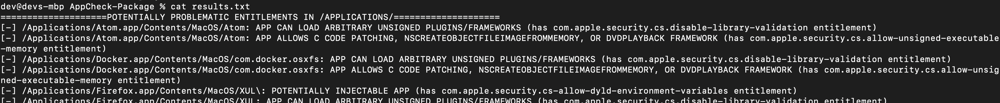

# EntitlementCheck
Wrapper around the codesign binary to recursively check installed apps for problematic entitlements. Currently it checks for:

- com.apple.security.cs.disable-library-validation
- com.apple.security.cs-allow-dyld-environment-variables
- comapple.security.get-task-allow
- com.apple.security.cs.allow-unsigned-executable-memory
- com.apple.security.files.downlaods.read-only
- com.apple.security.files.downloads.read-write 
- com.apple.security.files.all (deprecated...but you never know...)
- com.apple.security.files.user-selected.read-only 
- com.apple.security.files.user-selected.read-write 

The following directories are checked:
- /Applications
- /usr/local/bin 
- /usr/bin 
- /usr/sbin

## Steps

1. `chmod +x AppChecker.sh`
2. `./EntitlementCheck.sh `
3. ignore stdout and check results.txt when done

